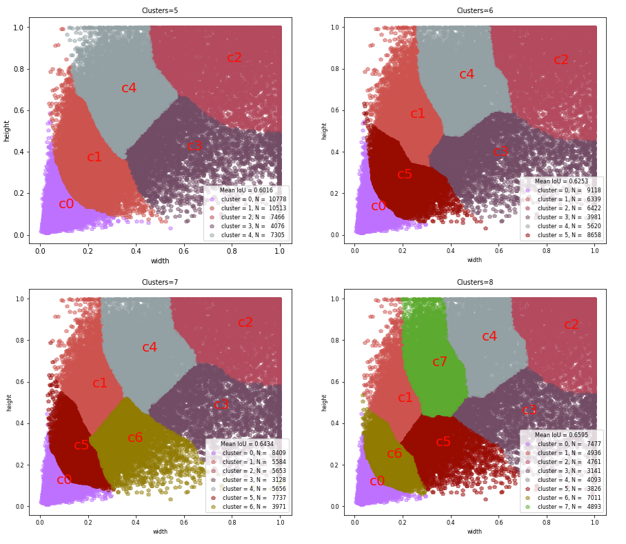
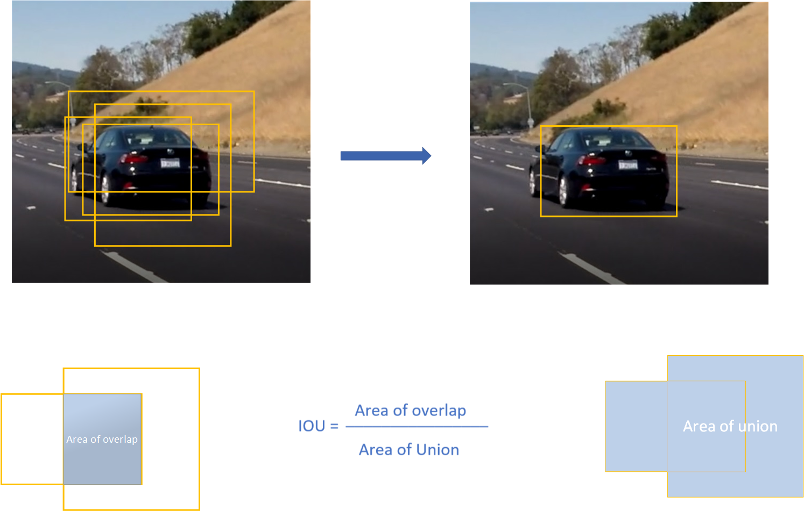

## part 1. Introduction

Implementation of YOLO v3 object detector in Tensorflow (TF-Slim). This repository  is inspired by [Paweł Kapica](https://github.com/mystic123) and [Kiril Cvetkov
](https://github.com/kirilcvetkov92). The full details are in [this paper](https://pjreddie.com/media/files/papers/YOLOv3.pdf).  In this project we cover several segments as follows:<br>
- [x] [YOLO v3 architecture](https://github.com/YunYang1994/tensorflow-yolov3/blob/master/core/yolov3.py)
- [x] Weights converter (util for exporting loaded COCO weights as TF checkpoint)
- [x] Basic working demo
- [x] Non max suppression on the both `GPU` and `CPU` is supported
- [x] Training pipeline
- [x] Compute COCO mAP

YOLO paper is quick hard to understand, along side that paper. This repo enables you to have a quick understanding of YOLO Algorithmn.


## part 2. Quick start
1. Clone this file
```bashrc
$ git clone https://github.com/YunYang1994/tensorflow-yolov3.git
```
2.  You are supposed  to install some dependencies before getting out hands with these codes.
```bashrc
$ cd tensorflow-yolov3
$ pip install -r ./docs/requirements.txt
```
3. Exporting loaded COCO weights as TF checkpoint(`yolov3.ckpt`) and frozen graph (`yolov3_gpu_nms.pb`) . If you don't have [yolov3.weights](https://github.com/YunYang1994/tensorflow-yolov3/releases/download/v1.0/yolov3.weights). Download and put it in the dir `./checkpoint`
```bashrc
$ python convert_weight.py --convert --freeze
```
4. Then you will get some `.pb` files in the dir `./checkpoint`,  and run the demo script
```bashrc
$ python nms_demo.py
$ python video_demo.py # if use camera, set video_path = 0
```

## part 3. Train on your own dataset
Three files are required as follows:

- `dataset.txt`: 

```
/home/yang/test/tensorflow-yolov3/data/train_data/train2017/000000458533.jpg 18.19 6.32 424.13 421.83 20 323.86 2.65 640.0 421.94 20 
/home/yang/test/tensorflow-yolov3/data/train_data/train2017/000000514915.jpg 55.38 132.63 519.84 380.4 16
# image_path, x_min, y_min, x_max, y_max, category_id,  x_min, y_min, ... category_id, 
```
- `anchors.txt`

```
10,13, 16,30, 33,23, 30,61, 62,45, 59,119, 116,90,  156,198,  373,326
```

- `class.names`

```
person
bicycle
car
...
toothbrush
```

### 3.1 train raccoon dataset
[raccoon dataset](https://github.com/YunYang1994/raccoon_dataset) has only one class, I have prepared a shell script in the '`./scripts` which enables you to get data and train it ! Finally `python quick_test.py1` , here I strongly recommend you to set `iou_thresh = 0.5, score_thresh=0.3`.
```
$ sh scripts/make_raccoon_tfrecords.sh
$ python quick_train.py
$ python convert_weight.py -cf ./checkpoint/yolov3.ckpt-19000 -nc 1 -ap ./data/raccoon_anchors.txt --freeze
$ python quick_test.py
```

### 3.2 train VOC dataset
Download VOC-2007 trainval  and test data
```bashrc
$ wget http://host.robots.ox.ac.uk/pascal/VOC/voc2007/VOCtrainval_06-Nov-2007.tar
$ wget http://host.robots.ox.ac.uk/pascal/VOC/voc2007/VOCtest_06-Nov-2007.tar
```
Then you need to edit your VOC dataset path in `make_voc_tfrecords.sh`. In this step, you will extract some useful information such as bounding box, category id .etc from VOC dataset and convert them into some `.tfrecord`
```
$ sh scripts/make_voc_tfrecords.sh
$ python show_input_image.py   # show your input image (optional)
$ python train.py
```

### 3.4 train coco dataset
Firstly, you need to download the COCO2017 dataset from the [website](http://cocodataset.org/)　
```bashrc
$ wget http://images.cocodataset.org/zips/train2017.zip
$ unzip train2017.zip
$ wget http://images.cocodataset.org/annotations/annotations_trainval2017.zip
$ unzip annotations_trainval2017.zip
```
Then you are supposed to extract some useful information such as bounding box, category id .etc from COCO dataset and generate your own `.txt` file.
```
$ python scripts/extract_coco.py -h
```
As a result, you will get  `train2017.txt`.  Here is an example row for one image:<br>
```
/home/yang/test/tensorflow-yolov3/data/train_data/train2017/000000458533.jpg 18.19 6.32 424.13 421.83 20 323.86 2.65 640.0 421.94 20 
/home/yang/test/tensorflow-yolov3/data/train_data/train2017/000000514915.jpg 55.38 132.63 519.84 380.4 16
# image_path, x_min, y_min, x_max, y_max, category_id,  x_min, y_min, ... category_id, 
```
In this step, you will convert image dataset into some `.tfrecord`  which are a kind of recommended file format for Tensorflow to store your data as  binary file. Finally, you can train it now!
```
$ python core/convert_tfrecord.py -h
$ python train.py
```
Take [yolov2](https://github.com/YunYang1994/tensorflow-yolov2_from_scratch) training process for example, 

### 3.4 evaluate coco dataset
```
$ wget http://images.cocodataset.org/zips/test2017.zip
$ wget http://images.cocodataset.org/annotations/image_info_test2017.zip 
$ unzip test2017.zip
$ unzip image_info_test2017.zip
```

## part 4. Why it is so magical ?
YOLO stands for You Only Look Once. It's an object detector that uses features learned by a deep convolutional neural network to detect an object. Although we has successfully run these codes, we must understand how YOLO works. 
### 4.1 anchors clustering
The paper suggests to use clustering on bounding box shape to find the good anchor box specialization suited for the data. more details see [here](https://nbviewer.jupyter.org/github/YunYang1994/tensorflow-yolov3/blob/master/docs/Box-Clustering.ipynb)


### 4.2 Architercutre details
In this project, I use the pretrained weights, where we have 80 trained yolo classes (COCO dataset), for recognition. And the class [label](./data/coco.names) is represented as  `c`  and it's integer from 1 to 80, each number represents the class label accordingly. If `c=3`, then the classified object is a  `car`.  The image features learned by the deep convolutional layers are passed onto a classifier and regressor which makes the detection prediction.(coordinates of the bounding boxes, the class label.. etc).details also see in the below picture. (thanks [Levio](https://blog.csdn.net/leviopku/article/details/82660381) for your great image!)


### 4.3 Neural network io:
-  **input** : [None, 416, 416, 3]
-  **output** : confidece of an object being present in the rectangle, list of rectangles position and sizes and classes of the objects begin detected. Each bounding box is represented by 6 numbers `(Rx, Ry, Rh, Rw, Pc, C1..Cn)` as explained above. In this case n=80, which means we have `c` as 80-dimensional vector, and the final size of representing the bounding box is 85.  why is 85? see also in the below picture

As you can see in the above picture, The first number `Pc` is the confidence of an project, The second four number `bx, by, bh, bw` represents the information of bounding boxes. The last 80 number each is the output probability of corresponding-index class.

### 4.4 Filtering with score threshold

The output result may contain several rectangles that are false positives or overlap,  if your input image size of `[416, 416, 3]`, you will get `(52X52+26X26+13X13)x3=10647` boxes since YOLO v3 totally uses 9 anchor boxes. (Three for each scale). So It is time to find a way to reduce them. The first attempt to reduce these rectangles is to filter them by score threshold.

**Input arguments**: 

- `boxes`: tensor of shape [10647, 4)] 
- `scores`: tensor of shape `[10647, 80]` containing the detection scores for 80 classes. 
- `score_thresh`: float value , then get rid of whose boxes with low score

```
# Step 1: Create a filtering mask based on "box_class_scores" by using "threshold".
score_thresh=0.4
mask = tf.greater_equal(scores, tf.constant(score_thresh))
```

### 4.5 Do non-maximum suppression

Even after yolo filtering by thresholding over, we still have a lot of overlapping boxes. Second approach and filtering is Non-Maximum suppression algorithm.

* Discard all boxes with `Pc <= 0.4`  
* While there are any remaining boxes : 
    * Pick the box with the largest `Pc`
    * Output that as a prediction
    * Discard any remaining boxes with `IOU>=0.5` with the box output in the previous step

In tensorflow, we can simply implement non maximum suppression algorithm like this. more details see [here](https://github.com/YunYang1994/tensorflow-yolov3/blob/master/core/utils.py)
```
for i in range(num_classes):
    tf.image.non_max_suppression(boxes, score[:,i], iou_threshold=0.5) 
 ```
 
Non-max suppression uses the very important function called **"Intersection over Union"**, or IoU. Here is an exmaple of non maximum suppression algorithm: on input the aglorithm receive 4 overlapping bounding boxes, and the output returns only one



Hope it helps you, Start your tensorflow-yolv3 journey here now!

## part 5. Some Other Tutorials

[- **`YOLOv3_TensorFlow`**](https://github.com/wizyoung/YOLOv3_TensorFlow)

[- **`Implementing YOLO v3 in Tensorflow (TF-Slim)`**](https://itnext.io/implementing-yolo-v3-in-tensorflow-tf-slim-c3c55ff59dbe)

[- **`Object Detection using YOLOv2 on Pascal VOC2012`**](https://fairyonice.github.io/Part_1_Object_Detection_with_Yolo_for_VOC_2014_data_anchor_box_clustering.html)

[-**`Understanding YOLO`**](https://hackernoon.com/understanding-yolo-f5a74bbc7967)

[-**`YOLOv3目标检测有了TensorFlow实现，可用自己的数据来训练`**](https://mp.weixin.qq.com/s/cq7g1-4oFTftLbmKcpi_aQ)<br>

[- `学员分享 | 小哥哥和用YOLOv3做目标检测的故事「文末送课」`](https://mp.weixin.qq.com/s/dFiOkUsal62EoME52Iw-uQ)

[-`目标检测|YOLOv2原理与实现(附YOLOv3)`](https://zhuanlan.zhihu.com/p/35325884)

[-` YOLOv2は、2016年12月25日時点の、速度、精度ともに世界最高のリアルタイム物体検出手法です。`](https://github.com/leetenki/YOLOv2/blob/master/YOLOv2.md)

[-` 知乎专栏-目标检测yolov2`](https://zhuanlan.zhihu.com/p/35325884)
